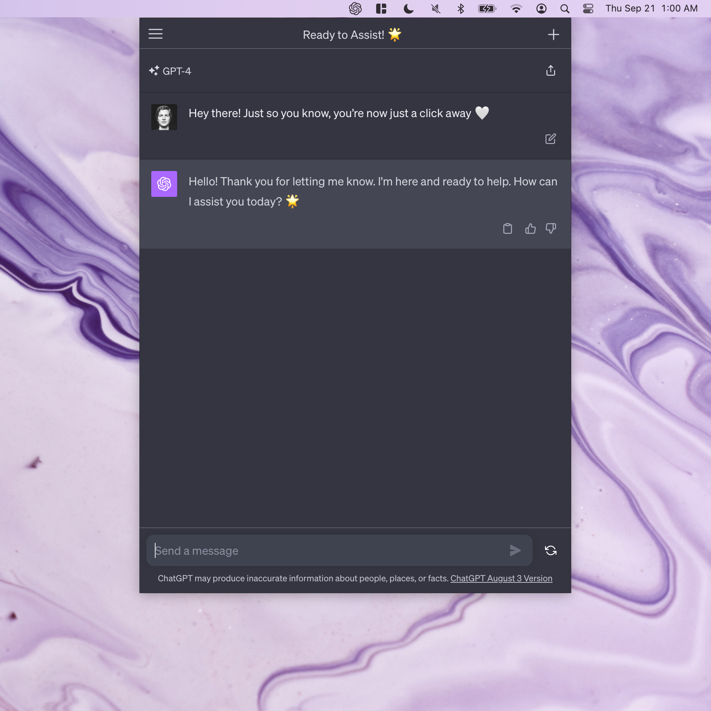

# chatgpt-mba

> Use ChatGPT from your menu bar

`chatgpt-mba` is a Menu Bar App for ChatGPT: https://chat.openai.com

It enables you to use ChatGPT directly from your menu bar, making it easy to quickly access insights, answers or have casual conversations without switching between windows or browsers.

*Note: This project is not affiliated with ChatGPT.*

<p align="center">
  
</p>

## Features

- One-click access to ChatGPT
- Runs on Windows, Mac & Linux
- ChatGPT icon in your menu bar

## Prerequisites

- [Rust](https://www.rust-lang.org)
- [Tauri](https://tauri.app)

## Running the application

To run `chatgpt-mba`:

```sh
pnpm install
pnpm tauri dev
```

## Contribute

To contribute to this project, kindly [fork the repository](https://github.com/ctate/chatgpt-mba/fork) and submit a pull request containing your modifications.

## License

[MIT](https://github.com/ctate/chatgpt-mba/blob/main/LICENSE)

## Acknowledgements

Thank you [ChatGPT](https://chat.openai.com)
